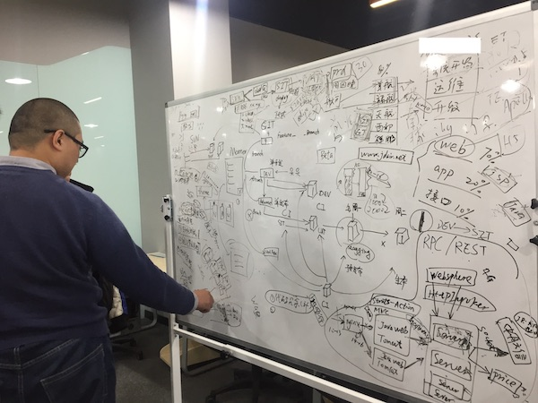
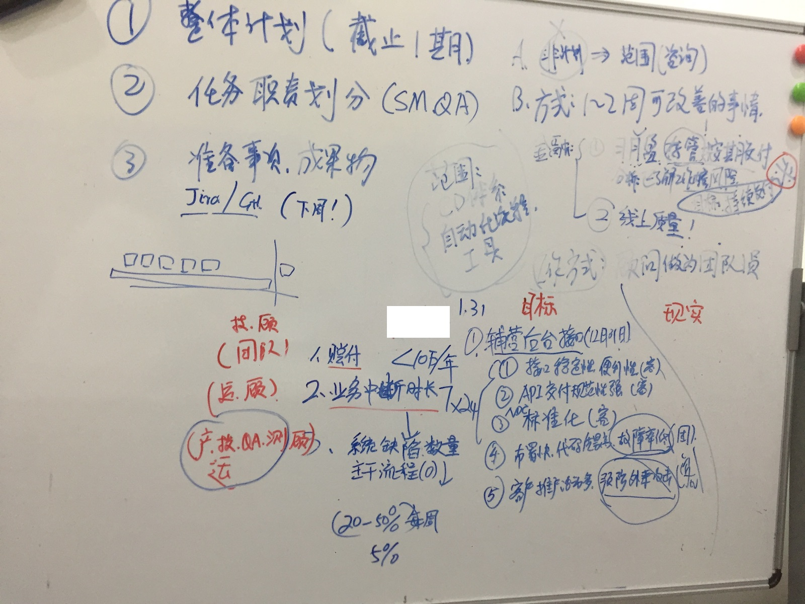
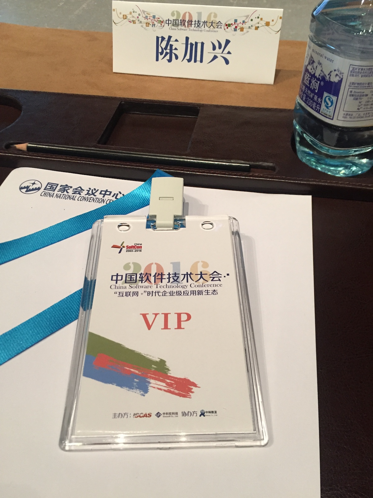
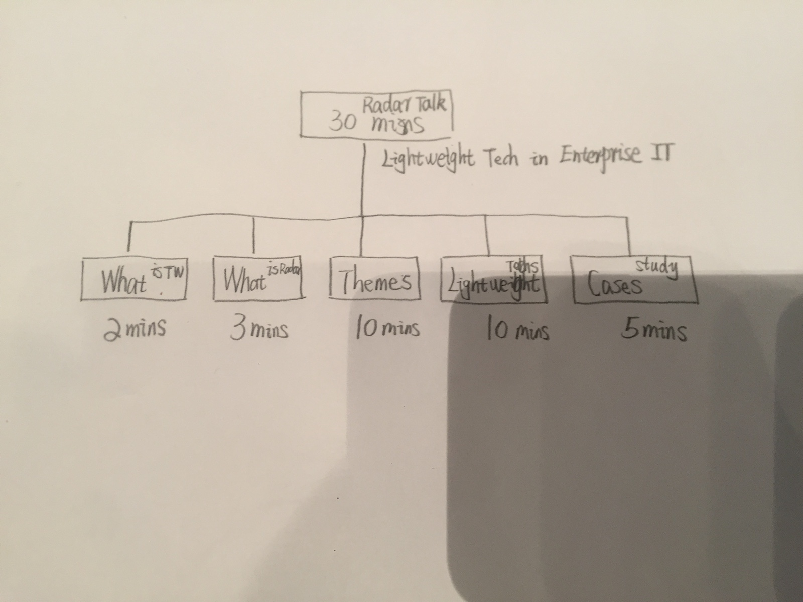

# 第二章 顾问的知识

2016年的某一个下午，我、张硕还有居总（客户）在一起讨论项目推进过程中的问题，其中一个是 `svn` 向 `git` 切换。说着说着，张硕把白板推过来，画了一条曲线，我顿时纳闷了，他在干嘛？他要干嘛？

画完了曲线，张硕在曲线上“啪啪”打了两个点，说：

?> 当我们讲一个新事物的时候，一开始只有少数人接受。但只要我们不断地讲，就有更多人理解它了，到这个点，大多数人被影响到，就是新事物被团队接受的转折点了。

我和居总听完了，没有任何表示。张硕又画了个图，开始讲一些商业方面的东东，讲完了，我们两个还是没有任何表示。沉默了一会儿，我说：

?> 我和居总都是学经济学的，可能对模型已经有了免疫力。

下图是根据客户架构师口述画出来的部署过程现状……

一会儿客户组织了一个启动会，气氛比较开放，直接在办公室把大家召集到工位间的大空间，技术负责人说，我们接下来要做的事，我总结了一下，就是九个字：

?> 搭班子、定制度、建能力。

我一听吃了一惊：这个人很有想法啊，相比前期交流过程中的沉默，完全换了一个人。

启动会结束后，我找到技术负责人，讨论 `svn` 切换的问题。技术负责人说，大家都知道 `git` 更好，但操作不熟悉，尤其是现在的发布流程有非常多的文件挑选，`git` 上做不到文件级的管理。

我就告诉他，`git` 也能实现文件挑选，插件叫 `cherrypick`，技术负责人将信将疑，问我们是否可以提供培训，我说不但可以提供培训，我们还可以亲自动手帮助你们快速完成迁移。技术负责人听完，马上就敲定了培训和迁移的时间。

说干就干，我调了两个技术顾问过来，围绕客户使用 `svn` 的场景和操作，制定了一份 `git` 培训材料，然后，安排了一个上午整个开发团队暂停，根据统一的操作步骤指令，一、二、三，切换完成，再在每个开发人员电脑上进行验证，成功。

我对林帆说：“每个开发人员的电脑你都要去check一下。”他正在现场……

`git` 迁移完成后，改进动作迅速扩大。

对当前的客户部门，重要的三件事：部署（自动化）、架构设计规范、需求规范。

启动另一个新部门的改进工作，重要的三件事：计划、职责、成果，第一个成果应是马上要执行的任务的结果。

然后又回到客户架构师亲自画的架构全景……

我的一次现场改进分析……

## 知识的差异

我（们）有很多大、中型企业的咨询项目经验，上述是一个较为普遍的案例。涉及到两个问题：

1. 顾问应该使用何种知识来解决客户的何种问题？
2. 顾问的知识形态和客户有什么根本上的差异？

### 解释性的知识

在[序言](consultants/0-preface.md)中谈到，客户在咨询项目中对顾问的期望是“传递理解”，因此，澄清模糊的概念——尤其是市面上满天飞的新名词——是顾问的必备知识，在澄清过程中阐明一些理论、模型，可以帮助顾问“有理有据”地证明自己的观点可靠性。

?> 但这些都是手段，而非目的。在每一次“传递理解”的过程中，顾问应该清楚地知道，重点是“下一步”，客户受到何种启发、将采取何种行动。

这样一来，顾问说什么，运用什么样的知识，就是一项关键能力了——更深层次地说，顾问的知识，停留“知道”的层面是不够的，还需要知道如何运用、在哪里运用这种知识。

我使用布鲁姆分类法，教育领域著名的认知金字塔来说明。顾问对知识的认知层级，至少应在 Level 3 “应用”之上。

?> **方法论的有效与无效** 
掌握了方法与工具，是否意味着拥有更好的解决问题的能力？方法论，实际上是一种“特殊的技巧性的知识（problem-sloving skills）”。比如，数字，是一种符号知识，算术，是一种符号加运算知识，而速算，是一种技巧知识。 
一个常见的速算方法是对 11 的两位数乘法的简化：$AB * 11 = A(A+B)B$

如果我们使用“已知/未知”的广义问题框架来说明，方法论是对已知问题的快速解决路径，顾问可以快速搭建一个解决问题的步骤，但问题解决，依赖于各个步骤中“具体的举措”，即顾问对问题上下文的操作性知识的掌握程度。

!> 顾问的方案效果最终取决于应用层级的（操作性）知识，大部分传统咨询的情景中，客户拥有操作性知识，而在敏捷咨询的过程中，是顾问的操作性知识推动客户项目的进展，因此，赋能（Empowerment），是敏捷咨询中相当重要的环节。

## 结构化的知识

从上述的例子我们还看到，客户的原始叙述“相当的复杂”，很多技术架构，用我的说法是根本就没有“架构”，就是把业务长什么样，从头到尾用代码写了一遍。

现在许多架构师强调“抽象”、“简化”，抽象与简化对应到布鲁姆金字塔是“分析（Analysis）”和“综合（Synthesis）”能力，这两种能力实际上都有相当的稀缺性，而底层依赖的是“知识的结构化”。

?> 幸运的是，除了“天生的结构化能力”之外，每个人都可以利用手、纸、笔对散乱的知识进行结构化的整理，通过多个步骤来提高自己的分析、综合能力。

在那个项目期间刚好我作为嘉宾参加了一场技术大会，演讲题目是《技术雷达——新技术与企业IT转型》，我认为，在这次演讲中的重要贡献，就是定义了 ThoughtWorks 的 Slogan：致力于工程创新的组织

?> Slogan 就是一种简化，“工程创新”则是对能力的抽象，组合起来，就是使用一个概念来抽象、简化一个组织的业务特征。

我到现场的时候，将演讲分割成了几个部分。不过“分解了”也不代表能够“执行好”，最后我又双叒叕超时了……

!> 实践是任何知识的闭环。邓小平说得更高大上一点：实践是检验一切真理的唯一标准。

## 海量的知识

顾问的知识怎么来的呢？至少对我来说，“拥有很多知识”总是被周围人惊讶和羡慕，其实没有什么秘密，我的秘密就是听到什么从来没听说过的知识时，顺手就就把它记下来，比如我在台下听左春讲区块链，早在2014年左右我就读了区块链的第一本书，但左春讲的一点很有启发，我就顺手记了下来：

!> 顾问拥有丰富的知识，源于点点滴滴积累的习惯！

知识 **K**nowledge、实践 **P**ractices（操作性知识及操作）以及天赋 **T**alent（习惯的力量），是顾问运用所拥有的知识发挥效用的独特之处。

$$
R = f(K, P, T)
$$

上面的公式是我从一个哈佛的课程中看到的，参数的顺序表示了它对结果影响的重要性，我特别喜欢，就收集起来了，后面关于知识与实践的内容，我会围绕这个公式展开。
