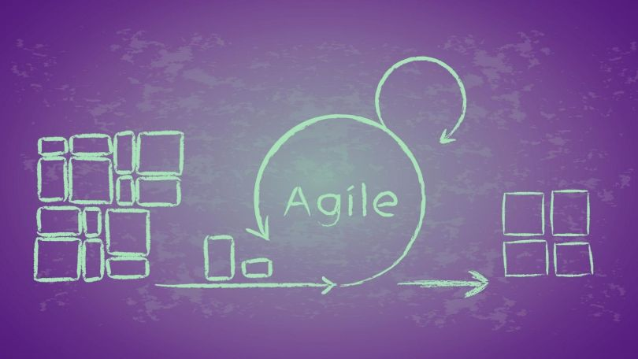

# 第三章 敏捷再思考

前些天我问一位在央企工作的朋友：“SAFe 有什么问题？在你们公司实施不下去的原因是什么？”

!> 朋友说：“文化自信。”

更早的时候我们讨论了敏捷在其企业实施的障碍，我说，如果“做敏捷（Doing Agile）”只是引入一些实践，大多数敏捷实践并不适合你们公司的产品、组织，企业不需要具体的敏捷实践，而是根据行业的特点判断需要何种敏捷性，以及敏捷性的程度。

## 多面敏捷

对敏捷行业内的人来说，十年前就已经把“敏捷”和各种具体的敏捷框架分开了，我们谈“敏捷”的时候，泛指相对“瀑布”重量级过程的轻量级开发模式；我们谈 Scrum 的时候，指小团队迭代运作；我们谈 XP 的时候，指重构、自动化测试；我们谈 SAFe 的时候，指“主流”。:smile:

而对敏捷行业外的人来说，除了对“快”的基本误解，常见的就是下面这幅图：

对发起“敏捷宣言”的一群人来说，敏捷的目标很简单，就是消除过程管理成本，尽可能回归软件开发的专业性。但随着“敏捷”影响力的扩散，不同组织中不同利益相关者对敏捷的理解，决定了敏捷多面性的产生。

## 团队运作

在早期（2010年前），“敏捷团队”由企业中的精英开发者组成，集中在一处办公，聚焦完成专项、重大的项目。

?> **多面之一：集中式团队** 
许多IT重大项目也采用了集中业务、技术及项目管理人员的方式，与人员分散在不同部门相比，沟通的成本降低了，决策速度变快了（随时可以发起会议），但延误照旧、缺陷不断。 
这些集中式项目团队规模也不大，与敏捷相比唯一的区别是，没有采用迭代式开发。

“迭代”比“集中”，更能解释敏捷发挥效用的原因。仅聚焦团队实践的敏捷，感受到的最大阻力在于组织架构的约束，但无论是上面的例子，还是我在招商银行的改进实践，都证明了，组织架构不是敏捷的必要条件，通过局部节奏一致的软件过程可以解决协同上的难点。

!> 软件开发过程上的特征，更接近敏捷的真实面。

那么，企业为何相继走向了敏捷开发过程？

## 规模化运作

在中期（2010年~2015年），“规模化敏捷”开始兴起，以 Scrum 为代表的小团队运作框架被企业的采纳程度，超过了 XP 为代表的工程实践框架，SAFe 在 2011 年提出，代表了“规模化”趋势的成型。

“规模化敏捷”是两个极端软件世界对抗的结果：一个极端是移动开发与云计算的兴起，软件产品迭代速度在加快，基础设施启用和变更在简化，开始不断对传统软件产生冲击；另一个极端是传统软件产品、IT系统，功能和交付规模越来越大，效率和质量越来越低下。

!> 轻装骑兵（敏捷）与重装步兵（瀑布）在阵地上相遇了。

显而易见，重装步兵的转型并不是要“骑兵化”，而是提升步兵的机动性：轻装步兵。快速调整组织模式，比把每一个步兵练成神枪手（精英开发者）更符合企业的实际情况。

最早尝试“规模化敏捷”的高科技公司，如电信行业，采用了打破产品、开发、测试部门竖井，合并为多个跨职能小团队，由于全球化交付的特点，中国团队测试、测试开发、QA居多，因此，国内敏捷教练多专注在质量改进的测试自动化实践上。

测试自动化是“轻装步兵”的“投枪”么？

?> **多面之二：测试自动化** 
一些走在前面的传统企业对测试自动化不可谓不重视、不尽力，但效果全都不尽人意。 
一家银行年年巨资投入搞自动化测试，五六年了没有起到任何效果，因为始终不能覆盖一条产品、或一个切面模块，系统每天都在变，自动化测试跟不上变化，所以怎么做都不可能有用处。 
另一家银行也投入了巨资建设自动化能力，前期策略是“先把用例库建起来，尽量完善，然后再看看项目有没有测试人员用，能不能用。”而自动化测试的真实表现是“跑不起来……挂上构建流水线也会被项目组关掉。” 
第三家是央企，管理部门极其重视，结果是结果更魔幻：每个迭代的自动化测试都是下一个迭代补的，为了应付管理部门的检查。 
投枪没建成，建成了没有炮弹的坦克，为了不损失步兵战斗力，还得持续掏钱买汽油。

“测试自动化”是“敏捷规模化”的一个局部特征，自动化的一部分，自动化是一个“能力系统（Capability System）”。

!> 能力系统中每一个组成元素有不同的获取周期，和不同的获取形式。

自动化能力，由需求质量、架构质量、系统质量、开发质量还包括部署质量、发布质量的共同治理构成，每一项子能力都有不同的成熟度、建设投入，无法由“自动化测试用例”来驱动。

我也谈谈自动化，它在制造业的精益生产中就已经是重要组成部分了，持续集成的构建信号灯完全借鉴了精益生产中的自动化思想。

!> 自动化甚至不能说是敏捷的专有特征。

那么，敏捷的真实一面究竟是什么呢？我们究竟为何做敏捷（Doing Agile），投入如此巨大的成本调整组织架构、构建自动化能力？

## 系统化运作

在近期（2016年至今），“企业级敏捷”出现，敏捷不再局限在开发、IT甚至软件，从横向、纵向，渗入进了业务、营销、财务，等等，也开始走向硬件与制造业。

“敏捷”受到了更高的挑战，许多原来研究企业战略、管理的学者也开始关注企业级的敏捷运作。这些挑战和关注，最终都能够回溯到企业内外环境呈现出的新特征：复杂度增加、变化加快。

!> 新环境所产生了普遍的不确定性。不确定性，正是敏捷诞生的真正原因。

如果说规模化敏捷是一整套偏向于基层、交付管理的运作框架，那么企业级敏捷，需要的是一套更具有行业、经营特征，满足高层管理、职能制度、资源分配、流程与决策方方面面的系统化运作框架。
